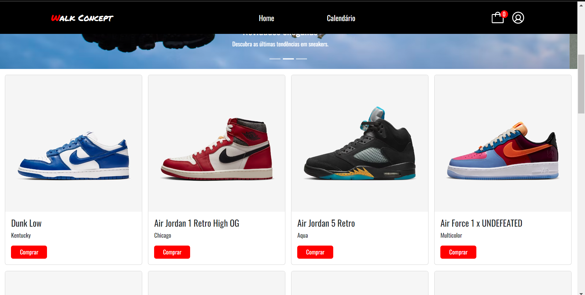

<h1 align="center">Walk Concept</h1>

  <a href="#-tecnologias">Tecnologias</a>&nbsp;&nbsp;&nbsp;|&nbsp;&nbsp;&nbsp;
  <a href="#-projeto">Projeto</a>&nbsp;&nbsp;&nbsp;|&nbsp;&nbsp;&nbsp;
  <a href="#-layout">Layout</a>&nbsp;&nbsp;&nbsp;|&nbsp;&nbsp;&nbsp;

 

  

## 🚀 Tecnologias

Esse projeto foi desenvolvido com as seguintes tecnologias:

- HTML 
- CSS
- JavaScript
- React.JS
- Bootstrap
- Sass
- Npm
- Notion
- Vite
- ChatGPT

## 💻 Projeto

Desenvolvido principalmente com React.JS e Bootstrap, este projeto simula a interface de um e-commerce de sneakers. Desenvolvi-o para praticar alguns dos fundamentos importantes do React.JS, como hooks, rotas, API de contexto e componentização.

## 🔖 Layout

Você pode visualizar o layout do projeto através [DESSE LINK](https://index-movies.vercel.app/).
